```{r setup, include=FALSE}
knitr::opts_chunk$set(echo = TRUE)
```

1. \bf{Create a project to perform your preprocessing}

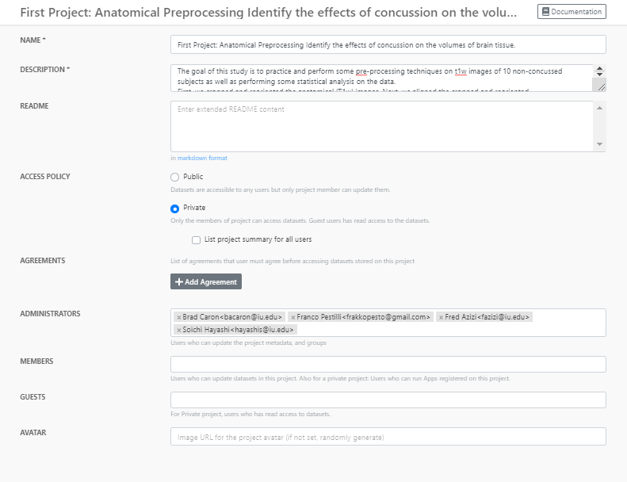


2.	\bf{Copying data from at least three open projects}

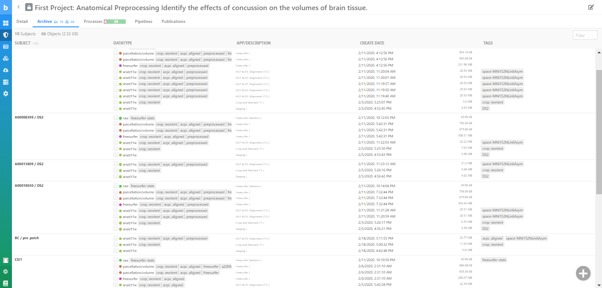


3.	\bf{Crop and Reorient the anatomical data}

   a. Staging Subjects 


   b. View the results
   
   >> \bf{Subject 1:}
    
   >>Pre Cropped/Reoriented:
   
   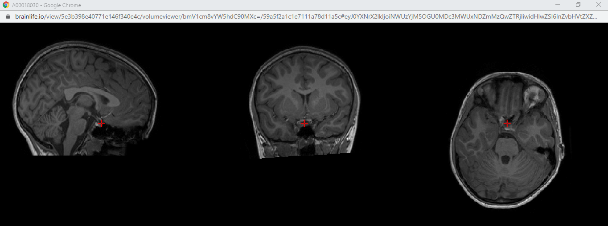

   
   >>Post Cropped/Reoriented:
   
   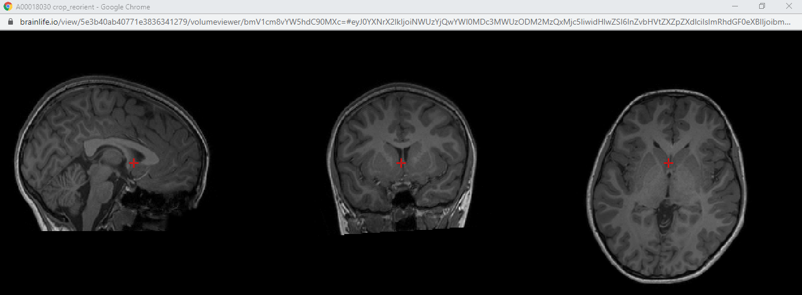


   >> \bf{Subject 2}
       
   >> Pre Cropped/Reoriented:

   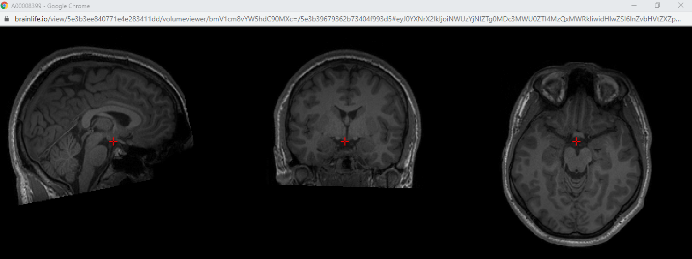

   >> Post Cropped/Reoriented:

   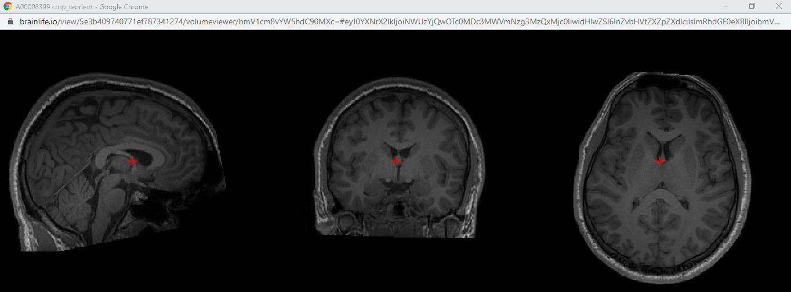


   >> \bf{Subject 3}

   >> Pre Cropped/Reoriented:

   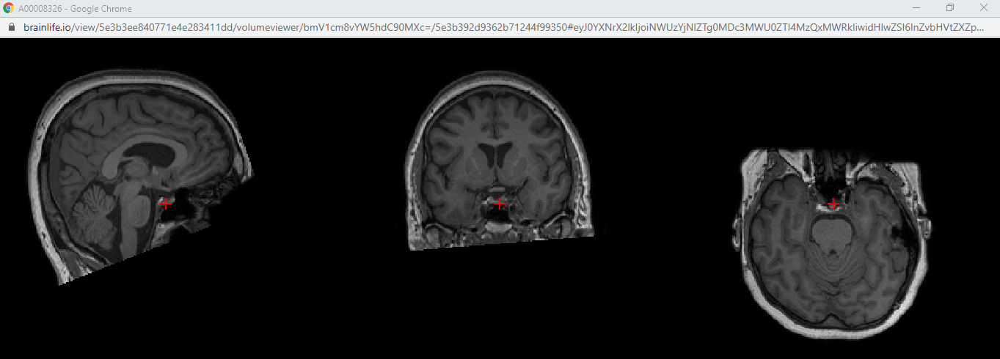

   >>Post Cropped/Reoriented:

   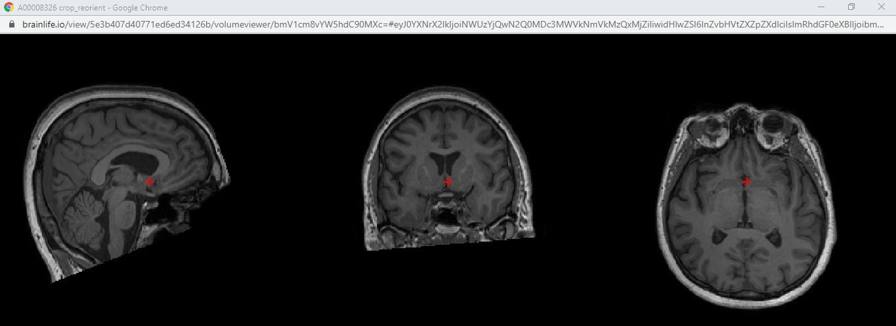


4. \bf{ACPC Alignment}

   >> \bf{Subject 1:}

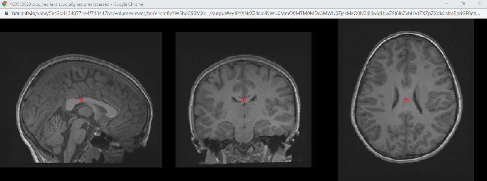

   >> \bf{Subject 2:}

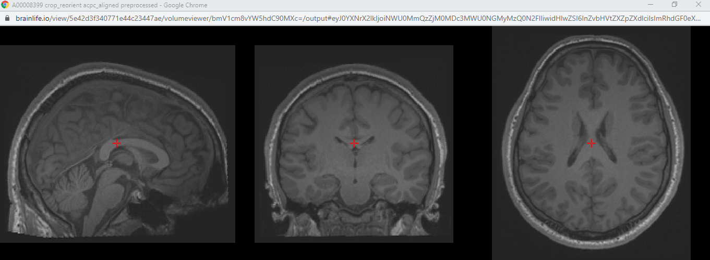


   >> \bf{Subject 3:}


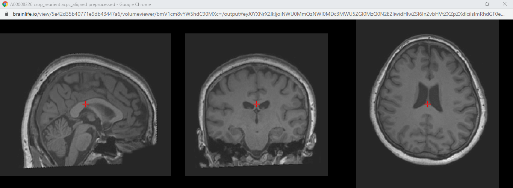


5. \bf{Freesurfer Parcellation}

   >>\bf{Subject 1:}
  
   >> L/R cortical surface:
   
   

>>	L/R white matter surface:

   

   >> aparc.a2009s.aseg loaded:

   


   >>\bf{Subject 2:}
   
   >> L/R cortical surface:
   

      
   >>	L/R white matter surface:


    
   >> aparc.a2009s.aseg loaded:
   

      
      
   >>\bf{Subject 3:}
   
   >> L/R cortical surface:


   
   >>	L/R white matter surface:


   >> aparc.a2009s.aseg loaded:


6. Freesurfer Statistics

```{r, message=F, echo=FALSE}
library(xlsx)
library(dplyr)
library(kableExtra)
library(ggplot2)
whole<-read.xlsx("Tot.xlsx", sheetIndex = 1)
rh<-read.xlsx("rh.xlsx", sheetIndex = 1)
lh<-read.xlsx("lh.xlsx", sheetIndex = 1)
```

a. The average (and standard deviation) volume of all the cortical structures across our healthy, non-concussed subjects (for the whole brain).

```{r, echo=F}
summary<-summarise(whole, 
                   mean=mean(Total.Cortical.Gray.Matter.Volume), 
                   sd=sd(Total.Cortical.Gray.Matter.Volume))
kable(summary)%>%
  kable_styling(position = "center")
```

b. The correlation coefficient between the total gray- and white-matter volumes and a scatterplot to show the relationship. 

```{r, echo=F}
c<-data.frame(correlation=cor(whole$Total.Cortical.Gray.Matter.Volume,whole$Total.White.Matter.Volume))
kable(c)%>%
  kable_styling(position = "center")
ggplot(whole, aes(x=Total.Cortical.Gray.Matter.Volume, y=Total.White.Matter.Volume))+
  geom_point()+
  theme_bw()+
  labs(x="Cortical gray matter volume", y=" White matter volume")+
   geom_smooth(method = "lm")
```

c. The correlation coefficient between the cortical (gray matter) volumes of the primary visual area and the precentral gyrus (for left hemisphere). 

```{r, echo=F}
pva<-lh$gray_matter_volume_mm.3[which(lh$structure_name=="Pole_occipital")]
gyrus<-lh$gray_matter_volume_mm.3[which(lh$structure_name=="G_precentral")]
c<-data.frame( correlation=cor(pva,gyrus))
kable(c)%>%
  kable_styling(position = "center")
p<-data.frame(pva=pva,gyrus=gyrus)
ggplot(p, aes(x=pva, y=gyrus))+
  geom_point()+
  theme_bw()+
  labs(x="Volumes of the primary visual area", y="Volume of the precentral gyrus")+
   geom_smooth(method = "lm")
```

d. The correlation coefficient between the cortical volumes of the hippocampus and the prefrontal cortex (for left hemisphere).

```{r, echo=F}
hippo<-lh$gray_matter_volume_mm.3[which(lh$structure_name=="G_temporal_middle")]
pfc<-lh$gray_matter_volume_mm.3[which(lh$structure_name=="G_front_sup")]
c<-data.frame(correlation=cor(hippo,pfc))
kable(c)%>%
  kable_styling(position = "center")
p<-data.frame(hippo=hippo,pfc=pfc)
ggplot(p, aes(x=hippo, y=pfc))+
  geom_point()+
  theme_bw()+
  labs(x="Cortical volumes of the hippocampus", y="Volume of prefrontal cortex")+
   geom_smooth(method = "lm")
```

e. The correlation coefficient between white matter volume and gray matter volume separately for both the left hemisphere and right hemisphere. You should have two correlations and plots, one for each hemisphere.

For left hemisphere:

```{r, echo=F}
lw<-whole$Left.Hemisphere.White.Matter.Volume
lg<-whole$Left.Hemisphere.Cortical.Gray.Matter.Volume

c<-data.frame( correlation=cor(lw,lg))
kable(c)%>%
  kable_styling(position = "center")

ggplot(p, aes(x=lw, y=lg))+
  geom_point()+
  theme_bw()+
  labs(x="Left hemisphere white matter volume", y="Left hemisphere cortical gray matter volume")+
   geom_smooth(method = "lm")
```

For the right hemisphere:

```{r, echo=F}
rw<-whole$Right.Hemisphere.White.Matter.Volume
rg<-whole$Right.Hemisphere.Cortical.Gray.Matter.Volume

c<-data.frame( correlation=cor(rw,rg))
kable(c)%>%
  kable_styling(position = "center")

ggplot(p, aes(x=rw, y=rg))+
  geom_point()+
  theme_bw()+
  labs(x="Right hemisphere white matter volume", y="Right hemisphere cortical gray matter volume")+
   geom_smooth(method = "lm")
```